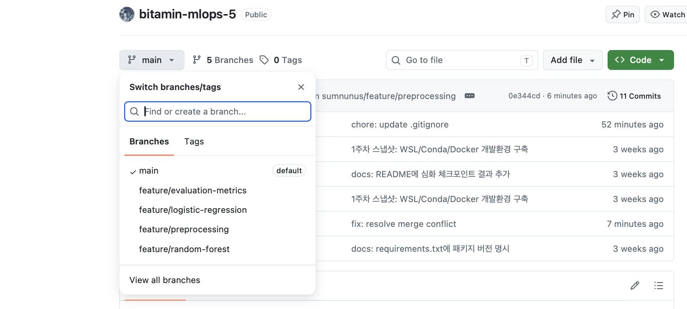
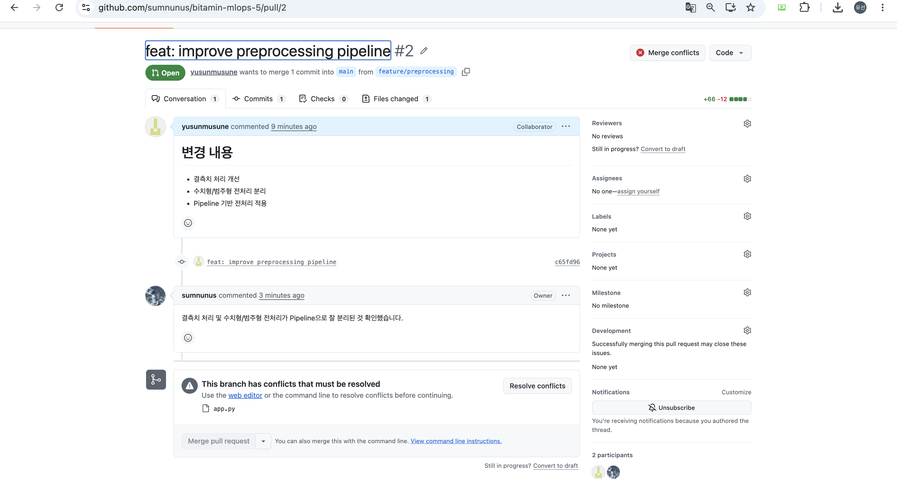

# Week 2 - Git 협업 실습

## 1. 조별 Repository 및 1주차 결과물 Push

조별 GitHub Repository를 생성하고 1주차 실습 결과물을 `main` branch에 push했습니다.

---

## 2. 조원별 Branch 생성

조원별 담당 기능에 따라 다음 branch를 생성했습니다.

- `feature/preprocessing`
- `feature/logistic-regression`
- `feature/random-forest`
- `feature/evaluation-metrics`

---

## 3. Pull Request 생성 및 코드 리뷰

각 담당 기능별 Pull Request를 생성하고 조원 간 코드 리뷰를 진행했습니다.

### Random Forest 모델 추가

.png>)

### 전처리 파이프라인 개선

---

## 4. 모든 PR Merge 완료

코드 리뷰와 충돌 해결을 마친 뒤 각 Pull Request를 `main` branch에 merge했습니다.

---

## 5. Merge Conflict 발생 및 해결

동일한 `app.py`를 각 branch에서 수정하는 과정에서 Merge Conflict가 발생했습니다.

최신 `main` branch를 병합한 뒤 충돌 코드를 직접 수정하고 commit 및 push하여 해결했습니다.

