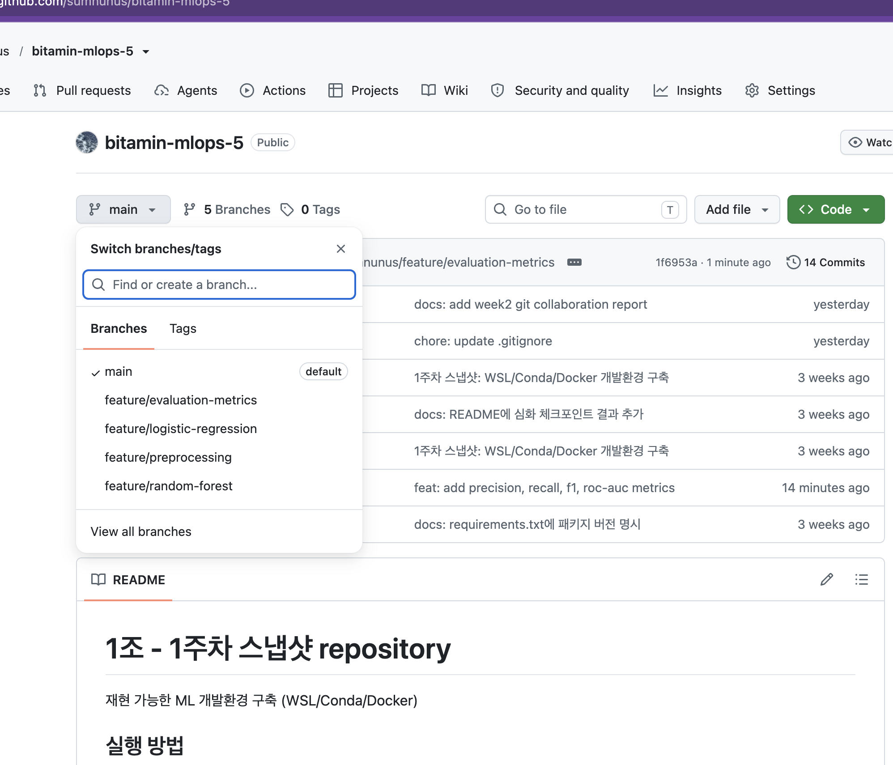

# Week 2 - Git 협업 실습 (hoofitech, 평가 Metric 담당)

## 1. 조별 Repository 및 1주차 결과물 Push

조별 GitHub Repository(`bitamin-mlops-5`)를 clone하여 실습에 참여했습니다.

---

## 2. Branch 생성 (`feature/evaluation-metrics`)

담당 기능(평가 Metric 추가)에 따라 `feature/evaluation-metrics` branch를 생성했습니다.

- `feature/preprocessing`
- `feature/logistic-regression`
- `feature/random-forest`
- `feature/evaluation-metrics` ← 담당 branch

---

## 3. Pull Request 생성 및 코드 리뷰

### 평가 Metric 추가 (본인 PR)

`app.py`에 Accuracy 외 Precision/Recall/F1/ROC-AUC 지표를 추가하고 PR #3을 생성했습니다.

- PR: `feat: add precision, recall, f1, roc-auc metrics`

### 다른 조원 PR 리뷰

Random Forest PR과 전처리 파이프라인 PR에 코드 리뷰 코멘트를 남겼습니다.

**Random Forest 모델 추가 (PR #1) 리뷰**

**전처리 파이프라인 개선 (PR #2) 리뷰**

---

## 4. 모든 PR Merge 완료

담당 PR(#3)을 포함해 조의 모든 PR이 main branch에 merge 완료되었습니다.

---

## 5. Merge Conflict 발생 및 해결

담당 branch(`feature/evaluation-metrics`)는 merge 시점에 다른 조원의 변경사항과 겹치는 부분이 없어 conflict 없이 병합되었습니다. (조 전체의 Merge Conflict 발생·해결 사례는 팀 공용 [README.md](./README.md) 5번 항목 참고)
