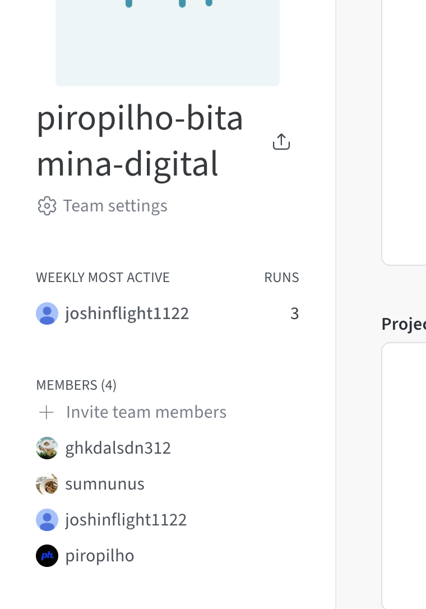
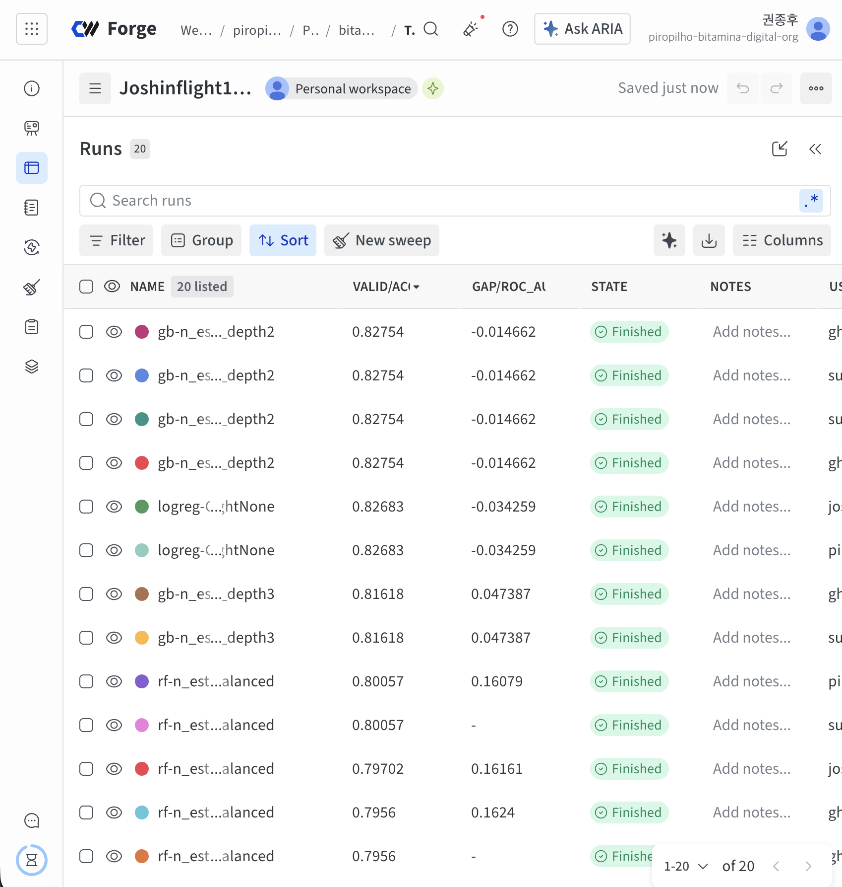
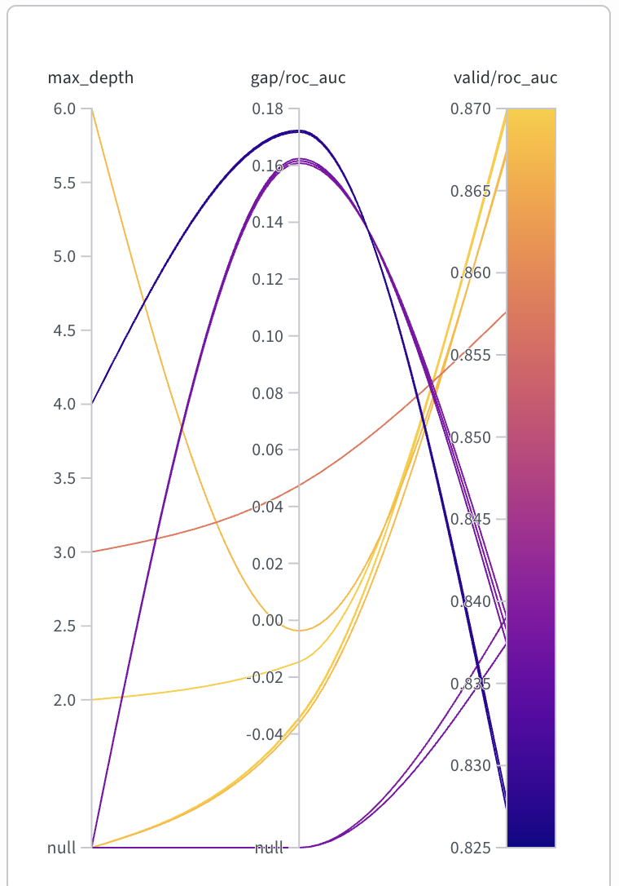

# Week 3 - W&B 실험 관리 (hoofitech, D: 평가·비교 담당)

- W&B Team: `piropilho-bitamina-digital`
- W&B Project: [bitamin17-week3-churn](https://wandb.ai/piropilho-bitamina-digital/bitamin17-week3-churn)
- 작업 branch: `feature/wandb-kwon`

## 필수 1. 조별 W&B Team 생성 및 조원 초대

Team `piropilho-bitamina-digital`에 조원이 참여했습니다.



Members (4): `ghkdalsdn312`, `sumnunus`, `joshinflight1122`, `piropilho`

## 필수 2. 조원 전원 첫 W&B run 기록

`train.py`의 `ENTITY`를 조 Team 이름으로 설정해 run이 개인 계정이 아닌 Team 프로젝트에 기록됩니다.
조원 4명(`ghkdalsdn312`, `sumnunus`, `joshinflight1122`, `piropilho`) 모두 run을 기록했습니다.



## 필수 3. 조 전체 6개 이상 실험 비교

모델 3종(logreg / rf / gb), 서로 다른 조건 8개, 총 run 20개를 비교했습니다.
각 run은 `train/*`, `valid/*`, `gap/roc_auc`를 함께 기록합니다. (`gap/roc_auc` = train AUC − valid AUC, 클수록 과적합)

### valid 기준 상위 run (valid/f1 순)

| 순위 | 조건 | f1 | Recall | Precision | ROC-AUC | gap |
|---|---|---|---|---|---|---|
| 1 | rf, max_depth 6 | 0.650 | 0.829 | 0.535 | 0.867 | -0.004 |
| 2 | logreg, C 0.01, balanced | 0.643 | 0.824 | 0.527 | 0.867 | -0.036 |
| 3 | logreg, C 1.0, balanced | 0.642 | 0.840 | 0.519 | 0.870 | -0.035 |
| 4 | logreg, class_weight 없음 | 0.639 | 0.578 | 0.715 | 0.870 | -0.034 |
| 5 | gb, lr 0.03, depth 2, n 300 | 0.628 | 0.548 | 0.735 | 0.870 | -0.015 |
| 6 | gb, lr 0.1 (기본) | 0.612 | 0.546 | 0.696 | 0.858 | +0.047 |
| 7 | rf, 깊이 제한 없음 (2주차) | 0.562 | 0.495 | 0.651 | 0.837 | +0.162 |
| 8 | gb, lr 0.3, depth 4 | 0.541 | 0.497 | 0.592 | 0.828 | +0.172 |

### Parallel coordinates (max_depth → gap/roc_auc → valid/roc_auc)



- 노랑(valid AUC ≈ 0.87)은 gap이 0 근처이고, 남색·보라(AUC ≈ 0.83)는 gap이 0.16~0.18입니다.
- 깊이 제한이 없는 RF와 lr 0.3 GB가 과적합입니다. gap이 클수록 valid AUC가 낮습니다.
- 깊이를 6으로 제한하면 RF의 gap이 +0.162에서 -0.004로 줄고 AUC가 0.837에서 0.867로 오릅니다.

> TODO: `valid/roc_auc` 정렬 Runs 표 캡처 추가 (`images-hoofitech/runs-sorted.png`)

## 필수 4. 평가 그래프 기록

선정한 최종 조건(`rf --max_depth 6`)으로 실행해 run 페이지에 `plots/confusion_matrix`, `plots/roc_curve` 패널이 기록되었습니다.

- run: https://wandb.ai/piropilho-bitamina-digital/bitamin17-week3-churn/runs/jz7i0orz

> TODO: 혼동행렬 · ROC 곡선 패널 캡처 추가 (`images-hoofitech/eval-plots.png`)

## 필수 5. 최종 모델 저장

### 선정 기준과 근거

- 기준 지표: `valid/f1` (Recall을 함께 확인)
- 선정: **Random Forest, `max_depth=6`** (`n_estimators=200`, `class_weight=balanced`)
- 근거
  - valid f1 0.650으로 전체 run 중 1위
  - Recall 0.829로 놓치는 이탈 고객이 적음 (이탈 예측은 놓친 이탈 고객이 적을수록 좋음)
  - gap -0.004로 과적합 없음
  - 대안인 logreg balanced와 f1 차이가 0.01 이내라 큰 차이는 아님

### test 평가 (train+valid로 재학습 후 test 1회 평가)

| 구분 | f1 | Recall | Precision | ROC-AUC |
|---|---|---|---|---|
| valid | 0.650 | 0.824 | 0.537 | 0.867 |
| test | 0.648 | 0.837 | 0.529 | 0.863 |

valid와 test 성능이 거의 같아 일반화가 잘 됩니다. 2주차 RF의 test Recall 0.448에서 0.837로 개선되었습니다.

```
python week3/train.py --model rf --max_depth 6 --save
```

- `models/churn_model.joblib` 저장 (git 제외, `.gitignore`)
- W&B Artifact `churn-model` (type: model) 업로드 완료

> TODO: `models/churn_model.joblib` 터미널 캡처, Artifacts `churn-model` 화면 캡처 추가 (`images-hoofitech/artifact.png`)
